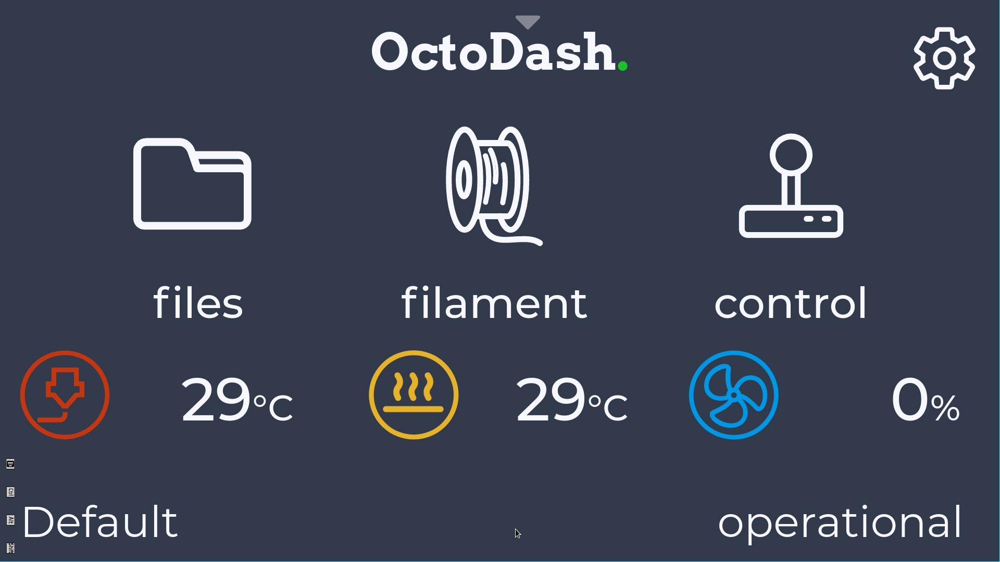

我们都知道使用 [Octo4a](https://github.com/feelfreelinux/octo4a) APP 可以让 Android 手机安装 [Octoprint](https://octoprint.org/)（如果不知道的话去看看 [[YouTube]How to run OctoPrint on your phone!](https://www.youtube.com/watch?v=74xdib_-X38&ab_channel=ThomasSanladerer)），从而使用手机就可以控制你的 3D 打印机。但是要想在手机上操作打印机或者查看打印状态，还是只能通过打开 Octoprint 的管理网页来实现，虽然安装了 Custom UI 后可以优化在手机上的显示排版，但是始终还是需要滚动来看到更多信息，如果 [Octodash](https://unchartedbull.github.io/OctoDash/index.html) 也能运行在手机上的话，那就能好看和方便很多。如今我做到了，所以我和大家分享一下我的步骤，希望能够帮到你。


<!--more-->

## 思路

1. 你需要一个已经安装且配置完成的 Octoprint 在你的 Android 手机上
2. 在手机上安装 [Termux](https://termux.com/)
3. 在 Termux 中安装 Debain 系统的 chroot 版本
4. 在 Debain 系统中安装 Octodash
5. 在手机上安装 Xserver XSDL
6. 测试在 Termux 中运行 Debain 下的 Octodash
7. 在 Termux 中添加 Octodash 为服务，并开启自动启动
8. 完成，在 Xserver XSDL 中使用 Octodash

## 开始

### 安装 Termux

从  [`Github Releases`](https://github.com/termux/termux-app/releases) 下载安装最新版 Termux，有能力的话可以开启 `SSH` 服务器，方便从电脑上进行接下来的操作。

### 安装并进入 Debain 系统

```sh
pkg install proot-distro
proot-distro install debian
proot-distro login debian --termux-home
```

### 安装 Octodash

- 安装依赖

    对[安装指导](https://github.com/UnchartedBull/OctoDash/wiki/Installation#manual-installation)的命令作了一些修改以适应当前系统
    
    ```sh
    apt update -y
    apt install -y libgtk-3-0 libnotify4 libnss3 libxss1 libxtst6 xdg-utils libatspi2.0-0 libuuid1 libsecret-1-0 libasound2 libgirepository-1.0-1 gir1.2-glib-2.0 libayatana-appindicator3-1
    ```
    
- 下载并安装最新版的 Octodash（替换下载链接为 [`Github Releases`](https://github.com/UnchartedBull/OctoDash/releases) 页面上最新版本的链接）

    ```sh
    wget -O octodash.deb https://github.com/UnchartedBull/OctoDash/releases/download/v2.3.1/octodash_2.3.1_arm64.deb
    dpkg -i octodash.deb
    ```

- 安装 Xserver

    ```sh
    apt install -y xserver-xorg x11-xserver-utils xinit libgtk-3-0
    ```

### 安装 Xserver XSDL

从  [`Google Play Store`](https://play.google.com/store/apps/details?id=x.org.server) 安装最新版 Xserver XSDL

安装好后打开 APP，在初始化页面上点击 `更改设备配置` -> `鼠标模拟` -> `鼠标仿真模式` ，选择 `桌面版，无仿真`。

完成后返回启动页面，等待启动完成后记下端口号，比如我的是 `4713`


### 测试 Octodash

回到 Termux 下的 Debian 系统中，创建脚本文件（如果不一样，替换端口号为你的端口号）

```sh
cat << EOF > /root/startdash.sh
#!/bin/bash
export DISPLAY=127.0.0.1:0
export PLUSE_SERVER=tcp:127.0.0.1:4713

octodash --no-sandbox 2>&1
EOF
chmod +x /root/startdash.sh
```

 运行脚本文件以测试 Octodash 是否正常运行

```sh
/root/startdash.sh
```

看到有信息输出且没有报错的话，切回 Xserver XSDL APP 查看此时是否显示了 Octodash 的初始页面


看到的话先不着急进行设置，测试通过后还需要下一步，把 Octodash 添加到 Termux 的服务中保证后台运行

### 配置 Octodash 服务

先 `Ctrl+C` 退出当前脚本，然后 `Ctrl+D` 退出当前终端，回到 Termux 终端后，继续后面的操作

确保已经回到 Termux 系统后，安装 termux-services 包，使 Termux 支持服务

```sh
pkg install termux-services
```

为 Octodash 创建服务

```sh
mkdir -p $PREFIX/var/service/octodash/log
ln -sf $PREFIX/share/termux-services/svlogger $PREFIX/var/service/octodash/log/run
cat << EOF > $PREFIX/var/service/octodash/run
#!/data/data/com.termux/files/usr/bin/sh
exec proot-distro login debian --termux-home -- /root/startdash.sh
EOF
chmod +x $PREFIX/var/service/octodash/run
```

启动 Octodash 服务，并设置为自动启动

```sh
sv up octodash
sv-enable octodash
```

> 日志文件位于 `$PREFIX/var/log/sv/octodash/current` 
>
> `sv` 可以进行的操作
>
> ```
> sv up octodash #启动服务
> sv down octodash #停止服务
> sv-disable octodash #关闭服务自动启动
> ```

### 完成

现在可以回到 Xserver XSDL APP，继续 Octodash 的初始化，配置完成后就可以看到这样的界面

> 如果打印机地址填写 127.0.0.1:5000 无法成功添加打印机的话，输入手机的内网 IP 进行连接即可成功添加



大功告成，如果你也成功了，欢迎在评论区分享你的成果！

## Notes

在配置的过程中总结了一些问题的经验和提示：

- 如果你的手机没有电池保护功能，会一直保持充电100%的话，过不久你的电池就会鼓包。建议下载 [Scene 4](https://github.com/helloklf/vtools) 手机管理工具，在工具中可以调整电池的充电策略，充电至90%后就停止充电，直道降至70%再继续充电，达到保护电池的目的。下载链接: https://github.com/helloklf/vtools/releases

- Octo4a自带的 Webcam 服务器使用起来有以下问题（MI6 遇到的）：

  - 无法设置分辨率，快照分辨率极低，导致生成的延时视频也是分辨率极低
  - 可以设置视频时开启闪光灯，却不能设置快照时开启
  - 每次触发快照都会发出相机的卡擦声，静音也无法关闭

  综上我最后使用了单独的 Webcam 软件: [IP Webcam](https://play.google.com/store/apps/details?id=com.pas.webcam)，解决了以上的问题，它还可以在网页上修改配置，非常方便

  > 如果你也更换了视频源，记得同时更新 Octodash 中的系统设置和延时插件的设置

- 这篇文章提到的每一个 APP 都要设置后台锁定，且在关闭这几个 APP 的省电策略，以保持一直后台运行。
